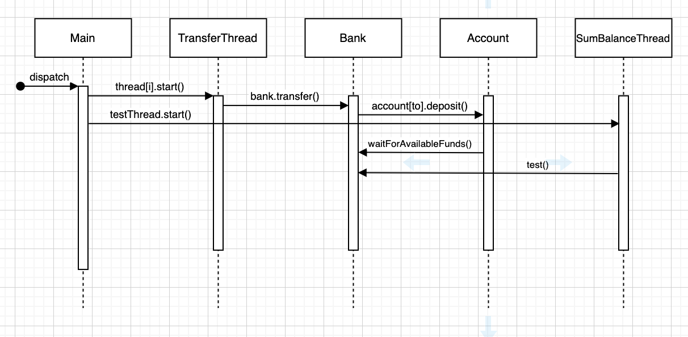
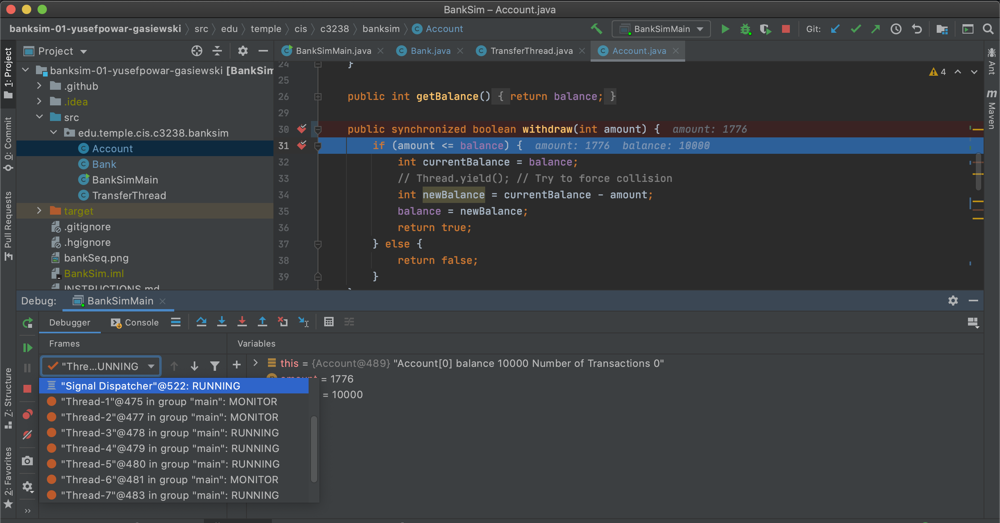
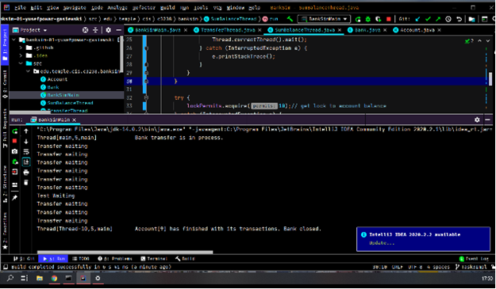
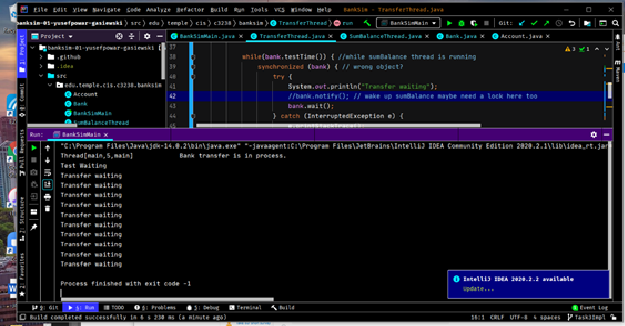
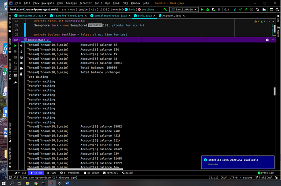
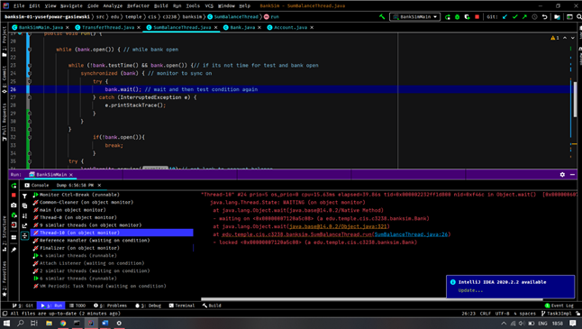

# BankSim

## Identifying race condition 

From the sequence diagram below, we can see that that as main crates “i” amount of threads and they all start to run. As they all run, each thread makes a call to bank.transfer and then to subsequent account.deposit This is where they can be and are interrupted. Accessing variables without any mutual exclusion is a bad idea and this causes the race condition.  

## Requirements
The requirement for this lab was to gain experience with multi-thread programming and implement solutions to eliminate any race conditons and deadlock scenarios so that the simulation ran reliably.  The main implementations are broken up into 5 tasks summarized below:

#### Task 1
 - Run the program and identify the race condition.
 - Draw a UML map.

#### Task 2
 - Fix race condition while still allowing for concurrent transactions between different threads.
 
What was implemented:
Synchronized blocks were added to the deposit and withdraw functions to prevent other threads from manipulating the same global variable at the same time.

#### Task 3
 - Create a testing thread and implement code protection to make sure that it signals and waits for all other threads to stop running before it tests.
 
 What was implemented:
 In bank 2 functions were created. testTime() to notify when it's test time and testDone() to notify when test it's done. A separate thread class was created to conduct tests, it is created when the transfer threads are and joins main when bank is closed. 10 Semaphore permits have been created, one for each account. Test must obtain all before doing its work. While it’s not test time, this thread waits to be notified. transfer threads work on a while loop under opposite conditions. A lock was implemented to protect to test time Boolean too. all functions sync on bank.

#### Task 4
 - Implement wait & notify methods to defer transfer until the account balance is sufficient.

What was implemented:
A waitForAvailableFunds function was added to the Account file and called in the transfer function.  Before a transfer occurs, this function checks to make sure that the bank is open and that sufficient funds for transfer are available.  If there aren't enough funds, the thread waits (wait()) until the deposit function notifies it with the notifyAll.

#### Task 5
- Implement a solution in which all threads stop transferring (the bank is closed) whenever one thread completes its transfers. 

What was implemented:
For task 5 2 functions were implemented in bank. Open() simple returns the Boolean variable that decides when the bank is open and bankClosed that when called, changes the Boolean condition and notifysAll threads. This is synced on bank.

## Teamwork
This pairing worked well.  There was healthy communication throughout the two weeks and we used tools like Zoom to share screens and discuss code. We both utilized Trello to keep track of tasks and maintain deadlines to ensure a timely completion of the project.  Akeem implemented solutions for Tasks 3 and 5 and developed the UML map.  Adam implemented solutions for Tasks 2 and 4 and completed the lab writeup.  For this specific lab, there wasn't much formal testing to be written. We utilized the debugger and breakpoints extensively to track changes in the threads as they moved through the program.  

## Testing: (All tests carried out were system Tests)

For all tasks, we performed manual testing by running the program and using the built-in Bank.test method.

### Task 2:

 - I mainly used the debugger and breakpoints to test my synchronization implementation.  It was clear after several runs that the race condition had been fixed since there were no more instances of account imbalances.  However, a stipulation mentioned is that multiple funds must be able to be transferred between different threads concurrently.  To test that this was happening, I set breakpoints within the withdraw and deposit functions and checked the debugger to ensure multiple threads were running.
 
 

### Task 3

Finding object to sync on, trying Thread.currentThead.wait();  output suggests race condition and deadlock. But with the test rate (Ntest) being every 5000 transfers I get the right amount of waitings. Will test if this is not a coincidence by changing Ntest to every 4000 transfers….it was, nothing works. complete reassessment needed.

New output has correct first step but then archives deadlock, object threads sync on has been changed to bank (obviously). The program acts unexpectedly but exits with code 0. As threads hit notify before hitting wait, this might be waking up TransferThreads that got to wait beforehand. will restructure. Having trouble with conditions test runs under will try a timed wait.  A single semaphore have been added to protect the testTime function as multiple transfer threads need to access it.  

Task 3 implemented. Output shows correct sequence of operations. Program has been run various times with various Ntest rates. Putting test thread on a time worked and integrating notify into testTime solved my previous problem of unexpected execution.

Code has been reformatted under guidance from Paul. Test thread now does not wait on a timer and the while loops has been reformatted, as has the transfer threads. Both are now more efficient. Test thread is no longer called in shouldTest(), it’s created in main and joins when bank closes. Further testing presented me with sporadic deadlocks at different stages of the simulation. This was later considered a java version issue but did give me a chance to understand thread dumps and use the debugger. 

### Task 4: 
- I ran into a few bugs while working on task 4.  I first implemented the wait and notify calls in the waitForAvailableFunds and deposit functions, respectively.  But upon the first run I noticed several nullpointerfunction errors occurring.  Upon analyzing the implementations made, I realized I forgot to add a myBank to the Account constructor.
- After fixing this, running the program resulted in a blank console.  It was evident that the test function wasn’t running for some reason.  I stepped through the relevant functions line by line as the code ran to make sure everything was working as intended when I noticed the waitForAvailableFunds() while-loop was being skipped every time.  I realized that this was because I neglected to prepend the first bank.open condition with an exclamation mark, since we initialized the bank-open boolean as false.  
- Fixing this made the program run fine, with no apparent race conditions.  I tested this by creating a for loop around the entire main program to automate output.  The program ran flawlessly over 1000 runs with no perceptible deadlock.

### Task 5: 

- Originally closeBank() was implemented as a Boolean returning the current state of the bank. This was problematic as each thread called the function regardless.

- Trying “synchronize (this)” caused more problems than it solved due to how I called the function and based the thread while loop on closeBank(). closeBank() was changed to void and boolean open() was introduced to represent state. This allowed me to get rid of “if/else” statement and update bank state in one atomic synchronized action.

- NotifyAll wasn’t implemented and trying to do this outside of a for each loop caused monitor errors. notifyAll was synchronized across all account objects so threads could update bank state.

- Threads that react to the notifyAll used to call thread.currentThread().interrupt() but this just guaranteed the deadlock I was trying to prevent. Now when any thread closes the bank, the others return.
